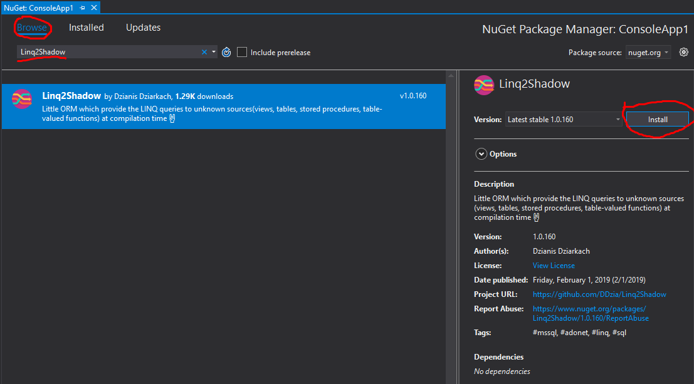

# Installation

## Installation via dotnet CLI
```cmd
dotnet add <path_to_project_file> package System.Data.SqlClient
```

## Installation via nuget package manager
```cmd
nuget install Linq2Shadow
```

## Installation via VS UI
* Choose destination project
* Mouse right click to him
* Press 'Manage Nuget Packages'


* Press 'Browse' tap
* Type 'Linq2Shadow' text
* Make make left-click on package record
* Press 'Install' button on right panel

